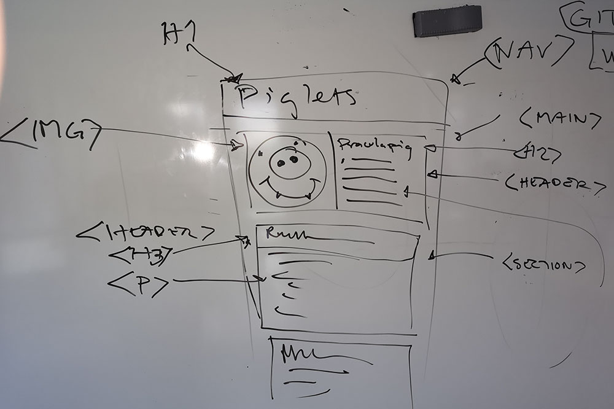

# wu1-songlist

Övning i att skapa en sidstruktur.

## Innehåll
* välj ett band
* välj en skiva från bandet
* hitta texterna till låtarna
* ladda ned skivomslaget
* om du vill ladda ned bandets logga

## Skiss

Målet är att skapa en sidstruktur som följande.

## Koda sidstrukturen

Tabba och använd emmet som hjälp.
Titta på skissen för att se vilka taggar som du bör använda.

[Commit för detta](https://github.com/jensnti/wu1-songlist/blob/966e12f4019051636811c7ccac6ed2716e3a04a9/index.html)

## Innehåll

Märk upp texten du har letat reda på.

[Commit för detta](https://github.com/jensnti/wu1-songlist/blob/e4631935faa2016cb73e6d3769bea2d2fa4fa8fd/index.html)