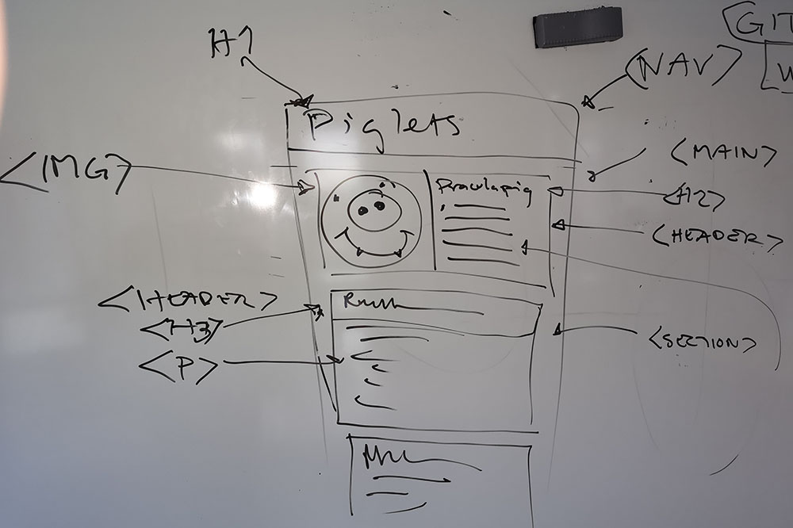

# wu1-songlist

Övning i att skapa en sidstruktur.

## Innehåll
* välj ett band
* välj en skiva från bandet
* hitta texterna till låtarna
* ladda ned skivomslaget
* om du vill ladda ned bandets logga

## Skiss

Målet är att skapa en sidstruktur som följande.

## Koda sidstrukturen

Tabba och använd emmet som hjälp.
Titta på skissen för att se vilka taggar som du bör använda.

[Commit för detta](https://github.com/jensnti/wu1-songlist/blob/966e12f4019051636811c7ccac6ed2716e3a04a9/index.html)

## Innehåll

Märk upp texten du har letat reda på.

[Commit för detta](https://github.com/jensnti/wu1-songlist/blob/e4631935faa2016cb73e6d3769bea2d2fa4fa8fd/index.html)

## Formattering

Använd CSS och display flex för en central layout.

### Font

Vi kan kolla vad bandet använder för font på deras hemsida.
Prova Chrome tillägget Font-ninja.

När vi vet det kan vi se om det är en google font, om så är fallet kan vi använda
[font joy](https://fontjoy.com/) för att skapa en font pairing.
Vi gör detta för att oftast vill vi ha ett läsbart typsnitt till brödtexten.

### Färger

För att skapa ett färgschema från sidan kan vi använda en tjänst som hämtar färger
ur skivans omslagsbild. Ett exempel på detta är [Adobe color](https://color.adobe.com/create/image)